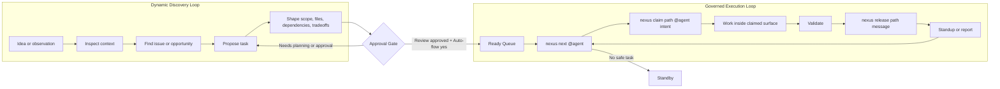

# Nexus Dynamic and Governed Loops Graphic Brief

## Core Insight

Nexus is dynamic before approval and deterministic after approval.

The system already supports dynamism because agents can discover issues, propose work, shape tasks, and surface dependencies. That dynamism is easy to miss because the execution loop is intentionally governed and repeatable.

## Graphic Goal

Create a clear visual that explains how Nexus handles both:

- dynamic discovery, planning, and proposal
- governed execution through approved queue work

The graphic should help users understand that Nexus is not a free-roaming autonomous agent system. It is a coordination workflow where agents can think and propose freely, but can only execute approved scoped work.

## Suggested Diagram Structure

Show two connected loops with a visible approval boundary between them.

### Loop 1: Dynamic Discovery Loop

Labels:

1. Idea or observation
2. Inspect context
3. Find issue or opportunity
4. Propose task
5. Shape scope, files, dependencies, tradeoffs
6. Wait for approval

Tone:

- exploratory
- generative
- allowed to be dynamic
- no file-changing execution unless separately approved and claimed

### Boundary: Approval Gate

Main label:

> Dynamic before approval. Deterministic after approval.

Supporting labels:

- human review
- `Review: approved`
- `Approved by: human`
- `Auto-flow: yes`
- task contract is complete

This gate should visually separate proposal from execution.

### Loop 2: Governed Execution Loop

Labels:

1. Ready Queue
2. `nexus next @agent`
3. `nexus claim <path> @agent "intent"`
4. Work inside claimed surface
5. Validate
6. `nexus release <path> "message"`
7. Standup/report if useful
8. Next safe task or Standby

Tone:

- deterministic
- repeatable
- file-scoped
- approval-bound
- safe for multi-agent concurrency

## Key Message

Agents may discover and propose freely.
Agents may execute only approved scoped work.

## What The Graphic Should Prevent

- Thinking Nexus is only a rigid task runner.
- Thinking Nexus lets agents freely invent and execute work.
- Treating `nexus next` as an ideation engine.
- Treating proposed work as executable work.
- Forgetting the approval boundary.

## Possible Formats

- Mermaid draft for README
- FigJam/Figma system map
- Dashboard explainer panel
- README hero diagram
- Short docs page with the two-loop graphic and examples

## Draft Mermaid Shape

## Later Design Notes

- Make the discovery loop feel more fluid than the execution loop.
- Make the approval gate visually prominent.
- Use different colors for "propose" versus "execute", but keep the overall palette restrained.
- The primary caption should be short enough to remember:

> Dynamic before approval. Deterministic after approval.

